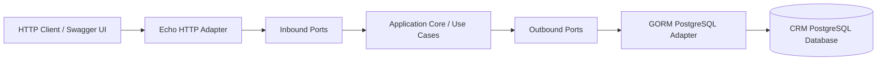

# microservices-blog-crm

This repository contains the CRM services and client applications for the blog platform.

## Go CRM service

The Go service is located in [`golang-crm`](./golang-crm). It follows hexagonal architecture:



The main layers are:

- `internal/domain`: business entities
- `internal/application/ports/in`: inbound application ports
- `internal/application/ports/out`: repository interfaces
- `internal/application/usecase`: application services
- `internal/adapters/http`: Echo routes and HTTP handlers
- `internal/adapters/postgres`: GORM repositories and database adapter

## Run locally

Start the CRM database from the repository root:

```sh
docker compose up -d db-crm
```

Configure `golang-crm/.env`, then start the API:

```sh
cd golang-crm
go run ./cmd
```

The default API port is `8080`. Available documentation endpoints:

- Swagger UI: <http://localhost:8080/docs>
- OpenAPI JSON: <http://localhost:8080/swagger.json>
- OpenAPI YAML: <http://localhost:8080/api.yml>

Main API groups include customers, products, and orders. For the complete endpoint list and request/response schemas, see the [Go CRM README](./golang-crm/README.md) and [OpenAPI specification](./golang-crm/api.yml).

Run checks from `golang-crm`:

```sh
go test ./...
go vet ./...
```

For live reload, install [Air](https://github.com/air-verse/air), then run `make run` from `golang-crm`.
