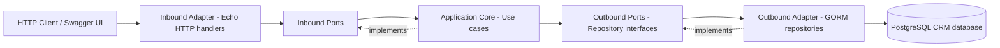

# Go CRM Service

CRM backend viết bằng Go, Echo và GORM/PostgreSQL. Service cung cấp API cho customers, products và orders, đồng thời xuất tài liệu OpenAPI/Swagger.

## Chạy local

Yêu cầu: Go 1.26+, PostgreSQL và database CRM đã có schema.

Tạo file `.env` trong thư mục `golang-crm`:

```env
PORT=8080
DB_HOST=localhost
DB_PORT=5433
DB_USERNAME=user_b
DB_PASSWORD=password_b
DB_NAME=crm_db
```

Chạy service:

```bash
cd golang-crm
go run ./cmd
```

Hoặc dùng Makefile:

```bash
make build
make test
make run
```

## API và Swagger

| URL | Mục đích |
|---|---|
| `GET /health` | Health check |
| `GET /api/v1/customers` | Danh sách customers |
| `POST /api/v1/customers` | Tạo customer |
| `GET /api/v1/customers/{id}` | Lấy customer theo UUID |
| `PUT /api/v1/customers/{id}` | Cập nhật customer |
| `DELETE /api/v1/customers/{id}` | Xóa customer |
| `GET /api/v1/products` | Danh sách products, hỗ trợ `limit`, `offset` |
| `GET /api/v1/products/{id}` | Lấy product theo ID |
| `GET /api/v1/orders` | Danh sách orders, hỗ trợ `limit`, `offset` |
| `GET /api/v1/orders/{id}` | Lấy order theo ID |
| `GET /api/v1/customers/{customerId}/orders` | Orders của customer |

Swagger UI: <http://localhost:8080/docs>

- OpenAPI JSON: <http://localhost:8080/swagger.json>
- OpenAPI YAML: <http://localhost:8080/api.yml>

Ví dụ tạo customer:

```bash
curl -X POST http://localhost:8080/api/v1/customers \
  -H 'Content-Type: application/json' \
  -d '{"name":"Alice Nguyen","email":"alice@example.com","city":"Hanoi"}'
```

## Cấu trúc database

Service sử dụng các bảng `customers`, `products`, `orders` và `order_details`. Customer ID là UUID; product và order ID là số nguyên tăng dần (`BIGSERIAL`).

## Kiến trúc Hexagonal

HTTP và PostgreSQL là các adapter bên ngoài. Application core chỉ phụ thuộc vào port, nên use case không phụ thuộc trực tiếp vào Echo, GORM hoặc PostgreSQL.



### Mapping trong source code

```text
cmd/main.go                         # Composition root / dependency wiring
internal/domain/                    # Domain entities
internal/application/ports/in/     # Inbound ports
internal/application/ports/out/    # Outbound ports
internal/application/usecase/      # Application services
internal/adapters/http/            # Echo routes và handlers
internal/adapters/postgres/        # GORM repositories và DB adapter
```

### Luồng request

1. HTTP adapter nhận request và chuyển input thành dữ liệu application.
2. Inbound port gọi use case tương ứng.
3. Use case sử dụng outbound repository port.
4. PostgreSQL adapter thực thi truy vấn bằng GORM.
5. Kết quả quay lại và được trả về dạng JSON.

## Kiểm tra

```bash
go test ./...
go vet ./...
```
