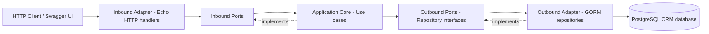

# Go CRM Service

A CRM backend built with Go, Echo, GORM, and PostgreSQL. The service provides customer, product, and order APIs and exposes OpenAPI/Swagger documentation.

## Local setup

Requirements: Go 1.26+, PostgreSQL, and a CRM database with the required schema.

Create a `.env` file in the `golang-crm` directory:

```env
PORT=8080
DB_HOST=localhost
DB_PORT=5433
DB_USERNAME=user_b
DB_PASSWORD=password_b
DB_NAME=crm_db
```

Start the service:

```bash
cd golang-crm
go run ./cmd
```

Or use the Makefile:

```bash
make build
make test
make run
```

## API and Swagger

| URL | Purpose |
|---|---|
| `GET /health` | Health check |
| `GET /api/v1/customers` | List customers |
| `POST /api/v1/customers` | Create a customer |
| `GET /api/v1/customers/{id}` | Get a customer by UUID |
| `PUT /api/v1/customers/{id}` | Update a customer |
| `DELETE /api/v1/customers/{id}` | Delete a customer |
| `GET /api/v1/products` | List products; supports `limit` and `offset` |
| `GET /api/v1/products/{id}` | Get a product by ID |
| `GET /api/v1/orders` | List orders; supports `limit` and `offset` |
| `GET /api/v1/orders/{id}` | Get an order by ID |
| `GET /api/v1/customers/{customerId}/orders` | List a customer's orders |

Swagger UI: <http://localhost:8080/docs>

- OpenAPI JSON: <http://localhost:8080/swagger.json>
- OpenAPI YAML: <http://localhost:8080/api.yml>

Create a customer:

```bash
curl -X POST http://localhost:8080/api/v1/customers \
  -H 'Content-Type: application/json' \
  -d '{"name":"Alice Nguyen","email":"alice@example.com","city":"Hanoi"}'
```

## Database schema

The service uses the `customers`, `products`, `orders`, and `order_details` tables. Customer IDs are UUIDs; product and order IDs are auto-incrementing integers (`BIGSERIAL`).

## Hexagonal architecture

HTTP and PostgreSQL are external adapters. The application core depends only on ports, so use cases do not directly depend on Echo, GORM, or PostgreSQL.



### Source code mapping

```text
cmd/main.go                         # Composition root / dependency wiring
internal/domain/                    # Domain entities
internal/application/ports/in/     # Inbound ports
internal/application/ports/out/    # Outbound ports
internal/application/usecase/      # Application services
internal/adapters/http/            # Echo routes and handlers
internal/adapters/postgres/        # GORM repositories and DB adapter
```

### Request flow

1. The HTTP adapter receives a request and converts it into application input.
2. The inbound port invokes the relevant use case.
3. The use case uses an outbound repository port.
4. The PostgreSQL adapter executes the GORM query.
5. The result travels back through the same layers and is returned as JSON.

## Checks

```bash
go test ./...
go vet ./...
```
