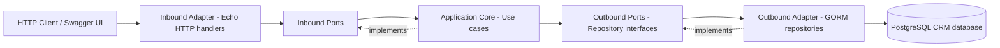

# Author Storefront Backend

Go/Echo/GORM backend matching `product-backend-schema.md`. It serves the author storefront's products, landing pages, blogs, contact form, guest cart and checkout APIs.

## Local setup

Requirements: Go 1.26+, PostgreSQL, and a CRM database with the required schema.

Create a `.env` file in the `golang-crm` directory:

```env
PORT=8080
DB_HOST=localhost
DB_PORT=5433
DB_USERNAME=user_b
DB_PASSWORD=password_b
DB_NAME=author_storefront
```

Start the service:

```bash
cd golang-crm
go run ./cmd
```

Or use the Makefile:

```bash
make build
make test
make run
```

## API and OpenAPI

| URL                                     | Purpose                      |
| --------------------------------------- | ---------------------------- |
| `GET /health`                           | Health check                 |
| `GET /api/products`                     | Product listing/filtering    |
| `GET /api/products/{slug}`              | Product detail with variants |
| `GET /api/landing-pages`                | Landing page listing         |
| `GET /api/blogs`                        | Blog listing/filtering       |
| `POST /api/contacts`                    | Store contact form lead      |
| `GET/POST /api/cart`                    | Read cart / add item         |
| `PATCH/DELETE /api/cart/items/{itemId}` | Change cart                  |
| `POST /api/orders`                      | Transactional checkout       |

Swagger UI: <http://localhost:8080/docs>

- OpenAPI JSON: <http://localhost:8080/swagger.json>
- OpenAPI YAML: <http://localhost:8080/api.yml>

The complete contract is in [`api.yml`](api.yml). Guest carts use `X-Session-ID`; when absent the server creates an HttpOnly `session_id` cookie.

## Database schema

The storefront schema is managed by the SQL script at
`../client-service/client-author/database/seed.sql`. The Go service only
connects to the already-provisioned schema at startup. Checkout uses
`store_orders` and `store_order_items` so it can coexist with legacy CRM order tables.
Checkout snapshots the authoritative product prices into the order items and
decrements stock atomically.

## Work order

1. Database: storefront persistence models, SQL schema and isolated checkout tables.
2. Logic: bounded-context use cases, repositories, cart session and transactional checkout.
3. API: Echo routes and `api.yml` matching the frontend/schema response shapes.

The legacy customer/product/order adapters remain in the tree temporarily only to keep the migration reversible; they are no longer wired into `cmd/main.go` or exposed as routes.

## Hexagonal architecture

HTTP and PostgreSQL are external adapters. The application core depends only on ports, so use cases do not directly depend on Echo, GORM, or PostgreSQL.



### Source code mapping

```text
cmd/main.go                         # Composition root / dependency wiring
internal/domain/                    # Domain entities
internal/application/ports/in/     # Inbound ports
internal/application/ports/out/    # Outbound ports
internal/application/usecase/      # Application services
internal/adapters/http/            # Echo routes and handlers
internal/adapters/postgres/        # PostgreSQL repositories and DB adapter
internal/adapters/postgres/models/ # Persistence-only GORM models
```

Storefront code is split into the `catalog`, `landing`, `blog`, `contact`, `cart`
and `checkout` contexts. Each context owns its domain types, inbound service
port, outbound repository port, use case and PostgreSQL repository. The models
under `adapters/postgres/models` are database records only; they are mapped to
domain types at the adapter boundary and never cross into the application core.

### Request flow

1. The HTTP adapter receives a request and converts it into application input.
2. The inbound port invokes the relevant use case.
3. The use case uses an outbound repository port.
4. The PostgreSQL adapter executes the GORM query.
5. The result travels back through the same layers and is returned as JSON.

## Checks

```bash
go test ./...
go vet ./...
```
